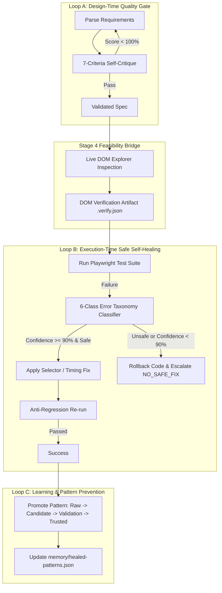

# QA-AI-AGENT-KBD — Context-Driven AI QA Automation Framework

> **Core Philosophy:**  
> *"Design intelligently ➔ Validate against reality ➔ Execute reliably ➔ Heal safely ➔ Learn permanently ➔ Prevent the same failure from recurring."*

---

## 🚀 Overview

**QA-AI-AGENT-KBD** is a production-grade, context-driven AI QA Automation Agent framework designed for testing the **KBD NopCommerce Storefront and Admin Portal**. 

Built on top of **Playwright (TypeScript)**, **Node.js**, and an **Autonomous 9-Stage AI Pipeline**, the framework eliminates test hallucinations, enforces zero soft-assertion fallbacks, ensures strict requirements-to-test traceability, and provides safe execution-time self-healing with a long-term memory engine.

---

## 🌟 Key Features

* **Strict 9-Stage Sequential Pipeline:** Ingests raw requirements, designs test cases, plans workflows, audits live DOM, generates POM test specs, validates traceability, executes tests with safe self-healing, generates executive HTML reports, and updates long-term memory.
* **3-Loop Engineering System:**
  * **Loop A (Design-Time):** Multi-criteria self-critique evaluating 7 quality axes (Coverage, Risk, Business Rules, Boundary Accuracy, Data Validity, Feasibility, Traceability).
  * **Feasibility Bridge (Stage 4):** Live DOM audit verifying real dynamic widgets (Select2 dropdowns, dynamic modals, overlays) before code generation.
  * **Loop B (Execution-Time Safe Self-Healing):** 6-class error taxonomy with a $\ge 90\%$ confidence gate. Automatically rolls back unsafe business logic changes (`NO_SAFE_FIX`).
  * **Loop C (Learning & Prevention):** Promotes healed locator/timing strategies into trusted patterns stored in [`memory/healed-patterns.json`](file:///c:/Users/BS01648/Desktop/QA-AI-AGENT-KBD/memory/healed-patterns.json).
* **Dual-Factor Assertion Standard:** Every test assertion validates both (1) Target Route/URL path state AND (2) Specific DOM element existence, container state, and non-empty content.
* **Centralized Selector Repository:** Selectors reside strictly in [`utils/selectors.ts`](file:///c:/Users/BS01648/Desktop/QA-AI-AGENT-KBD/utils/selectors.ts). Inline string locators in spec files are strictly prohibited.
* **Ban on Soft `if` Guards:** Core user actions (clicking submit, adding to cart, completing checkout) must use hard Playwright assertions (`await expect(locator).toBeVisible()`).
* **Custom Executive HTML Dashboard:** Standalone, interactive HTML reports with execution metrics, failure categories, self-healing logs, and accessibility audits.

---

## 📁 Repository Anatomy

```text
QA-AI-AGENT-KBD/
├── .agents/                      # AI Agent Pipeline Guidelines & Operating Rules
│   ├── AGENTS.md                 # Workspace Operating Guidelines & Master Rules
│   └── skills/                   # 10 Autonomous Stage Skills (00-testdata-environment to 09-learning-prevention)
├── agents/                       # Orchestrator (gate tracker) — enforces stage order, write-safety, staleness
│   ├── types.ts                  # StageId, StageDefinition, gate-check types
│   └── orchestrator.ts           # Orchestrator class — status/readiness per stage, not agent reasoning itself
├── requirements/                 # Stage 1 Source requirements (<story>/source.md, parsed.json, source.meta.json)
│   └── history/                  # Archived requirement versions (<story>-v{n}.md)
├── testcases/                    # Stage 2 Test Case Specifications (<story>.tc.md, .tc.json)
├── workflows/                    # Stage 3/4 Journeys & Live-Verification Logs (<story>.journey.*, .verify.*)
├── testdata/                     # Stage 0 Provisioned synthetic test data (<feature>/seed.json)
├── envs/                         # Environment manifests (staging.md, production.md) — write-safe flag
├── pages/                        # Page Object Models (POM)
│   ├── base.page.ts              # Abstract Base Page (dismissAllModals, waitForAjaxComplete)
│   ├── register.page.ts          # B2B & Customer Registration Page Object
│   ├── checkout.page.ts          # Wholesale Checkout & Cart Page Object
│   ├── wishlist.page.ts          # Catalog & Wishlist Management Page Object
│   ├── login.page.ts             # Storefront Login Page Object
│   └── admin/                    # NopCommerce Admin Portal Page Objects
├── utils/                        # Core Utilities & Central Selector Engine
│   ├── selectors.ts              # Centralized Locator Store (No inline selectors in spec files)
│   ├── env.ts                    # Multi-environment configuration loader (Staging, Dev, Local)
│   ├── helpers.ts                # Wait helpers, modal dismissals, data generators
│   ├── memory-helpers.ts         # Long-term pattern lifecycle & memory store reader/writer
│   ├── report-helpers.ts         # Custom HTML report generation engine
│   └── api-helpers.ts            # API setup & tear-down helpers
├── tests/                        # Playwright E2E Test Specs & Fixtures
│   ├── e2e/                      # Domain-grouped test specs (registration, catalog, checkout)
│   └── fixtures/                 # Test data seed fixtures
├── memory/                       # Self-Healing & Traceability Memory Engine
│   ├── context-store.json        # Global pipeline context store
│   ├── healed-patterns.json      # Machine-readable trusted & candidate selector patterns
│   ├── self-heal-log.json        # Execution self-heal audit log
│   └── traceability/             # Requirements-to-Test Traceability Matrix (<story>.md)
├── scripts/                      # CLI Scripts & Tooling
│   ├── run-pipeline.ts           # Autonomous multi-stage execution orchestrator
│   ├── validate-coverage.ts      # Traceability matrix and coverage validator (Stage 6)
│   └── generate-report.ts        # Custom HTML dashboard report generator (Stage 8)
├── reports/                      # Generated Executive Dashboard Reports
├── COMMANDS.md                   # Single source of truth for CLI & Playwright commands
├── playwright.config.ts          # Playwright test runner configuration
├── package.json                  # Dependencies, scripts, and project metadata
└── tsconfig.json                 # TypeScript compiler configuration
```

---

## 🔄 The 10-Stage Pipeline Specification (Stage 0-9)

Run `npx ts-node scripts/run-pipeline.ts --story=<story>` to see live READY/BLOCKED/COMPLETE status for every stage below (see `agents/orchestrator.ts`).

| Stage | Stage Name | Inputs | Primary Outputs | Gate Condition |
| :--- | :--- | :--- | :--- | :--- |
| **Stage 0** | **Test Data & Environment** | Feature scope | `testdata/<story>/seed.json` | Synthetic data provisioned; no PII; env write-safety confirmed. |
| **Stage 1** | **Context Ingestion** | `requirements/<story>/source.md` | `parsed.json`, `source.meta.json` | SHA-256 verified; Zero unresolved `NEEDS_CLARIFICATION` blocks. |
| **Stage 2** | **Test Case Design** | `parsed.json` | `<story>.tc.md`, `<story>.tc.json` | Loop A Self-Critique Gate Pass (Max 5 iterations). |
| **Stage 3** | **Workflow Design** | `<story>.tc.json` | `<story>.journey.md`, `.json` | 100% Test cases mapped to sequential user journeys. |
| **Stage 4** | **Live Site Verification** | `<story>.journey.json` | `<story>.verify.json` | **Feasibility Gate:** Live DOM inspected; dynamic widgets verified. |
| **Stage 5** | **POM Code Generation** | `<story>.journey.json`, `.verify.json` | `pages/*.ts`, `tests/e2e/*.spec.ts` | Code uses centralized [`utils/selectors.ts`](file:///c:/Users/BS01648/Desktop/QA-AI-AGENT-KBD/utils/selectors.ts) & trusted memory patterns. |
| **Stage 6** | **Coverage Validation** | `tests/e2e/*.spec.ts` | `memory/traceability/<story>.md` | 100% REQ-ID to test assertion mapping confirmed. |
| **Stage 7** | **Execution + Self-Heal** | `tests/e2e/*.spec.ts` | `memory/self-heal-log.json` | Suite passes, safe auto-heal executed, or `NO_SAFE_FIX` rollbacks. |
| **Stage 8** | **Custom Report** | Execution & Memory Artifacts | `reports/generated/<story>-report.html` | Custom executive interactive HTML dashboard generated. |
| **Stage 9** | **Learning & Memory** | Execution Outcomes | `memory/healed-patterns.json` | Self-heal pattern promoted to `TRUSTED` for future pre-emptive reuse. |

---

## 🛠️ Setup & Installation

### 1. Prerequisites
* **Node.js:** `>=18.0.0`
* **npm:** `>=9.0.0`

### 2. Installation
Clone the repository and install dependencies:
```bash
git clone <repository-url>
cd QA-AI-AGENT-KBD
npm install
```

### 3. Install Playwright Browsers
Install required browser binaries (Chromium, Firefox, WebKit):
```bash
npx playwright install chromium
```

### 4. Environment Configuration
Copy `.env.example` or `.env.staging` to `.env`:
```bash
cp .env.staging .env
```
Ensure your `.env` contains valid credentials and URLs for the target KBD NopCommerce environment:
```env
BASE_URL=https://staging.kbdstorefront.com
ADMIN_URL=https://staging.kbdstorefront.com/admin
CUSTOMER_EMAIL=qa.user@example.com
CUSTOMER_PASSWORD=SecurePassword123!
```

---

## ⚡ Execution Commands

Refer to [`COMMANDS.md`](file:///c:/Users/BS01648/Desktop/QA-AI-AGENT-KBD/COMMANDS.md) for the complete command registry. All single-feature tests default to single-worker visual mode (`--headed --workers=1`).

### Run Test Suites by Feature Domain
```bash
# B2B Registration Tests
npm run test:b2b

# Catalog & Wishlist Management Tests
npm run test:wishlist

# Wholesale Checkout & Order Placement Tests
npm run test:checkout

# All Main Feature Suites (Headed, 1 Worker)
npm run test:all:headed
```

### Run Playwright Modes
```bash
# Run all E2E tests headlessly
npm run test

# Run tests in Playwright UI Mode
npm run test:ui

# Run tests in Debug Mode (Playwright Inspector)
npm run test:debug
```

### Coverage & Traceability Audit
```bash
# Validate 100% requirement coverage against test spec assertions
npm run qa:coverage
```

### Generate Custom HTML Executive Reports
```bash
# Generate B2B Registration Executive Dashboard Report
npm run report:b2b

# Generate Wholesale Checkout Executive Dashboard Report
npm run report:checkout

# Generate Wishlist Executive Dashboard Report
npm run report:wishlist
```

### Execute Pipeline Stages via Orchestrator CLI
```bash
# Execute entire pipeline (Stage 1 to 8) for a story
npx ts-node scripts/run-pipeline.ts --story=wholesale-checkout

# Execute a specific stage (e.g., Stage 2: Test Case Design)
npx ts-node scripts/run-pipeline.ts --story=b2b-registration --stage=2
```

---

## 🧠 3-Loop Engineering & Safe Self-Healing Engine



### Error Taxonomy & Self-Healing Action Matrix

| Failure Class | Trigger Pattern | Self-Heal Action | Human Escalation? |
| :--- | :--- | :--- | :--- |
| `FLAKY_LOCATOR` | `TimeoutError`, element dynamic ID change | Multi-tier fallback updated in [`utils/selectors.ts`](file:///c:/Users/BS01648/Desktop/QA-AI-AGENT-KBD/utils/selectors.ts) | No (if Confidence $\ge 90\%$) |
| `SCRIPT_LOGIC_ERROR` | `expect()`, timing mismatch | Adjust wait state or step order in spec | No (if Confidence $\ge 90\%$) |
| `TEST_DATA_ISSUE` | Unique constraint / duplicate record | Trigger dynamic re-seeding generator | No |
| `ENVIRONMENT_ISSUE` | Network error, `502 Bad Gateway`, `ECONNREFUSED` | Quarantine test & trigger backoff retry | No |
| `UNSAFE_OR_BUSINESS_LOGIC` | Business rule mismatch / ambiguous UI | Transition to `NO_SAFE_FIX`; **Rollback immediately** | **YES** |
| `REAL_BUG` | Actual functional defect vs verified requirement | **DO NOT HEAL**. Flag real bug & quarantine test | **YES** |

---

## 📏 Quality & Compliance Rules

1. **Centralized Selectors (`utils/selectors.ts`):** Never inline string selectors (e.g. `page.locator('#button')`) inside spec files. All locators must be centralized in `utils/selectors.ts`.
2. **Dual-Factor Assertion Standard:** Assertions must verify both page URL state (`toHaveURL()`) and concrete element existence/content (`toBeVisible()`, `toHaveText()`).
3. **No Loose Assertions:** RegEx matches like `toHaveURL(/cart|checkout/)` or generic `bodyText.includes(...)` checks are strictly banned.
4. **Command Registry Sync (`COMMANDS.md`):** Whenever new test specs or scripts are added, [`COMMANDS.md`](file:///c:/Users/BS01648/Desktop/QA-AI-AGENT-KBD/COMMANDS.md) must be updated immediately.

---

## 📄 License & Maintenance

This framework is maintained by the QA & AI Engineering Team for **KBD NopCommerce Automated Quality Assurance**.
